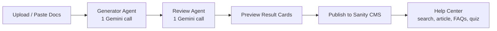

# LearnOps AI

AI-powered documentation publishing for customer education teams. Paste or upload raw product documentation and a two-agent pipeline turns it into a polished help article, FAQs, and a knowledge-check quiz — then publishes the approved bundle to Sanity CMS, where it appears instantly in a public, searchable Help Center.

Built with Next.js (App Router), Google Gemini, and Sanity, styled after the Harvey Legal Dark design system.

## Overview

Customer education teams receive raw docs (Markdown, plain text) and must manually rewrite them into customer-facing learning material, run an editorial pass, and publish. LearnOps AI automates that whole path:

1. An operator pastes documentation or uploads a `.md`/`.txt` file.
2. The **Generator Agent** (one Gemini call) produces a structured content bundle — title, slug, summary, article, FAQs, and quiz.
3. The **Review Agent** (one Gemini call) editorially improves the entire bundle for clarity, structure, and beginner-friendliness.
4. The operator previews the reviewed bundle in result cards and publishes it to Sanity with one click.
5. The **Help Center** reflects published content automatically, with keyword search, article pages, FAQs, and an interactive quiz.

A visual Agent Timeline animates each pipeline stage as it completes, with graceful error states and automatic retries for transient AI failures.

## Features

- **Paste or upload** documentation (`.md`, `.txt`) through a single content-source abstraction
- **Two-agent pipeline** — exactly two AI calls per run (generate, review), efficient within free-tier limits
- **Structured, validated output** — every AI response is parsed and validated against Zod schemas before use
- **Animated Agent Timeline** — Uploaded → Generator Agent → Review Agent → Publishing → Help Center Updated
- **Result cards** previewing the reviewed article, FAQs, and quiz before anything goes live
- **One-click publish** to Sanity CMS with success/error toasts
- **Public Help Center** — searchable article list, full article pages, FAQs, knowledge-check quiz
- **Resilience** — retry with backoff, rate-limit handling, missing-env detection, human-readable error messages
- **Accessible, responsive UI** — labeled inputs, visible focus states, ARIA live regions, screen-reader-friendly timeline, mobile-first layouts

## Architecture

The system is deliberately small and seam-oriented:

- **Two-agent pipeline.** The Generator Agent produces the full content bundle in one structured-JSON request; the Review Agent improves the whole bundle in a second request. No per-artifact calls.
- **One AI abstraction (provider-swap boundary).** All model access goes through `generateWithGemini` in `lib/ai/gemini.ts`. It owns client initialization, model config, structured JSON generation, parsing, Zod validation, retries, rate-limit handling, and typed error results. Agents know nothing about the provider — swapping Gemini for Claude or OpenAI touches one module.
- **Actions layer.** Next.js server actions (`actions/`) are the only bridge between UI and services: `generate-content`, `review-content`, `publish-to-sanity`, `fetch-articles`. Each returns a typed result, never throws raw errors into the UI.
- **Content-source abstraction.** `lib/content-source` normalizes every input (pasted text, uploaded file) to one trimmed documentation string. New formats (e.g. PDF) are added by registering a `FileContentExtractor` — the upload flow doesn't change.
- **Seam-based testing.** Tests inject fakes at the seams instead of mocking SDKs: `setModelCaller`/`setRetryDelays` replace the Gemini transport, and `setSanityWriter`/`setSanityReader` replace the Sanity client. The suite exercises real parsing, validation, retry, and error-mapping logic with no network access.

### Workflow Diagram



```
Upload → Generator Agent → Review Agent → Publish to Sanity → Help Center
```

## Folder Structure

```
learnopsai/
├── app/                      # Next.js App Router pages
│   ├── page.tsx              # Dashboard: upload form + pipeline workspace
│   └── help-center/          # Public Help Center (list + [slug] article page)
├── actions/                  # Server actions (UI ↔ services bridge)
│   ├── generate-content.ts   # Generator Agent
│   ├── review-content.ts     # Review Agent
│   ├── publish-to-sanity.ts  # Persist reviewed bundle
│   └── fetch-articles.ts     # GROQ reads for the Help Center
├── components/
│   ├── agents/               # Timeline, result cards, publish card, skeletons
│   ├── help-center/          # Search, article body, FAQ + quiz sections
│   ├── layout/               # Dashboard shell (nav, skip link)
│   ├── upload/               # Documentation form (paste / upload tabs)
│   └── ui/                   # shadcn/ui primitives
├── hooks/
│   └── use-content-generation.ts  # Client pipeline state machine
├── lib/
│   ├── ai/                   # Gemini abstraction, prompts, Zod schemas (provider-swap boundary)
│   ├── content-source/       # Paste/file input normalization (extension point)
│   ├── sanity/               # Sanity client factory + types
│   └── types/                # Shared domain types
├── sanity/                   # Sanity schema (helpArticle) for the Studio
├── tests/                    # Vitest suites (seam-injected fakes, no network)
├── utils/                    # Small pure helpers (slug, date, env, article parsing)
└── harvey.ai-design.md       # Design-system source of truth
```

## Tech Stack

- **Next.js 16** (App Router, Server Actions) + **React 19** + **TypeScript** (strict)
- **Tailwind CSS v4** + **shadcn/ui** (base-ui) — Harvey Legal Dark theme
- **Google Gemini** (`gemini-2.5-flash`) via `@google/genai`
- **Sanity CMS** via `@sanity/client` / `next-sanity` + GROQ
- **React Hook Form** + **Zod** for forms and AI-output validation
- **Vitest** for the test suite
- **sonner** for toasts, **lucide-react** for icons

## Setup

### 1. Install

```bash
pnpm install
```

### 2. Environment variables

```bash
cp .env.example .env.local
```

Fill in the values (see the table below):

- `GEMINI_API_KEY` — create one at [Google AI Studio](https://aistudio.google.com/apikey).
- Sanity variables — see the next step.

### 3. Create the Sanity project

1. Sign up / log in at [sanity.io/manage](https://www.sanity.io/manage) and create a new project with a `production` dataset.
2. Copy the **project ID** into `NEXT_PUBLIC_SANITY_PROJECT_ID`.
3. Create an API token with **Editor** permissions (Project → API → Tokens) and set it as `SANITY_API_TOKEN`.
4. Add the document schema to your Sanity Studio: this repo exports it from `sanity/index.ts` —

   ```ts
   import { schemaTypes } from "./sanity"; // → schema: { types: schemaTypes }
   ```

   The single document type is `helpArticle` (title, slug, summary, article, faqs, quiz, publishedAt). If you prefer, create a fresh Studio with `pnpm create sanity@latest` and paste in `sanity/schemas/help-article.ts`.

### 4. Run

```bash
pnpm dev          # start the app at http://localhost:3000
pnpm test         # run the Vitest suite
pnpm lint         # ESLint
pnpm build        # production build
```

## Environment Variables

| Variable | Required | Description |
| --- | --- | --- |
| `GEMINI_API_KEY` | Yes | Google Gemini API key used by both agents (server-side only). |
| `NEXT_PUBLIC_SANITY_PROJECT_ID` | Yes | Sanity project ID for reads and writes. |
| `NEXT_PUBLIC_SANITY_DATASET` | Yes | Sanity dataset name (default `production`). |
| `SANITY_API_TOKEN` | Yes (for publishing) | Server-side write token with Editor role. Never expose with `NEXT_PUBLIC_`. |

Missing configuration is detected at first use and surfaced as a clear, human-readable error instead of a crash.

## Future Improvements

- **Claude / OpenAI support** — the `generateWithGemini` boundary makes adding alternative providers a one-module change
- **Multi-agent orchestration** — specialized agents (structure, tone, fact-check) coordinated over the same bundle contract
- **ElevenLabs narration** — audio versions of published articles
- **Skilljar LMS integration** — push quizzes and articles into formal course flows
- **AI content governance** — policy checks and audit trails on generated content before publication
- **Content freshness monitoring** — flag published articles whose source documentation has changed
- **Scheduled review agents** — periodic re-review of the live catalog for accuracy and tone drift
- **Semantic search** — embedding-based Help Center search beyond keyword matching
- **Version-aware documentation updates** — regenerate only the sections affected by a doc change
- **Analytics dashboard** — article views, search misses, quiz pass rates
- **Human approval workflows** — multi-reviewer sign-off gates between review and publish
